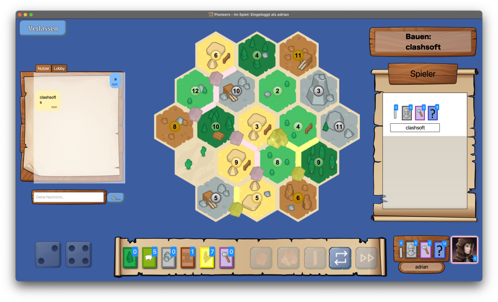

# Projekt Pioneers

**Developed by Team E for Softwaretechnik Praktikum (STP) 2022**

Projekt Pioneers is a multiplayer online game inspired by the classic strategy board game "The Settlers of Catan." It was developed in four release phases, with each phase introducing new functionalities, gameplay mechanics, and technical improvements.

## Table of Contents
- [Features](#features)
  - [Release 1](#release-1)
  - [Release 2](#release-2)
  - [Release 3](#release-3)
  - [Release 4](#release-4)
- [Screenshots](#screenshots)
- [Getting Started](#getting-started)
  - [Prerequisites](#prerequisites)
  - [Running the Project](#running-the-project)
- [Documentation](#documentation)
- [Authors](#authors)
- [Contributions](#contributions)

---

## Features

### Release 1
- **User Management**: Basic account creation and login system.
- **Lobby**: Shows a list of online users and available games; allows users to log out.
- **Direct Messaging**: Allows users to chat privately, view message history, and delete messages.
- **Game Management**: Users can create and join games, and see a list of participants.
- **Technical Requirements**: Dynamic updates through events, input validation, and a minimum of 50% test coverage.
- **Timeline**: April 25, 2022 - May 20, 2022.

### Release 2
- **User Profile**: Users can edit their username, password, and avatar.
- **Lobby Chat**: Adds a chat feature in the lobby for players to communicate.
- **In-Game View**: Displays map, players, resources, and building options.
- **Game Mechanics**: Introduces dice rolling, resource management, and building actions (e.g., settlements, roads).
- **Technical Requirements**: Minimum 60% test coverage, serverless and headless testing.
- **Timeline**: May 23, 2022 - June 17, 2022.

### Release 3
- **Game Options**: Adds options for selecting map size and victory conditions.
- **Observer Mode**: Allows non-participating users to view the game and participate in chat.
- **Trading System**: Players can trade with the bank, ports, or other players.
- **Additional Mechanics**: Includes robber placement, resource theft, and recognition of the longest road.
- **Technical Requirements**: Minimum 70% test coverage.
- **Timeline**: June 20, 2022 - July 15, 2022.

### Release 4
- **Predefined Maps**: Allows users to create and edit maps with random or preset configurations.
- **Custom Maps**: Players can manage, view, and vote on user-created maps.
- **Development Cards**: Adds the ability to buy and play development cards with special powers.
- **Achievements**: Displays "Largest Army" and other achievements at the end of the game.
- **Technical Requirements**: 80% test coverage and support for reconnecting after disconnection.
- **Timeline**: July 18, 2022 - August 12, 2022.

---

## Screenshots

1. **In-Game Interface**  
   

2. **Player Trade and Resource Management**  
   

3. **Map Editor**  
   

---

## Getting Started

### Prerequisites
- **Java** (version X.X)
- **Maven** (version X.X)
- Other dependencies specified in the `pom.xml` file.

### Running the Project

1. **Clone the Repository**
   ```bash
   git clone https://github.com/Ziyi-star/stp-22-team-e.git
   cd stp-22-team-e
   ```

2. **Build the Project**
   ```bash
   mvn clean install
   ```

3. **Start the Server**
   ```bash
   java -jar target/server.jar
   ```

4. **Launch the Client**
   Connect the client to the server to start playing.

---

## Documentation

For detailed API documentation, gameplay rules, and design specifications, please refer to the `docs/` folder in this repository.

---

## Authors

Projekt Pioneers was developed by a dedicated team of eight members from Team E as part of the Softwaretechnik Praktikum (STP) at the University of Kassel. Each member made significant contributions to the project’s design, development, testing, and documentation.

**Team Members:**
- Yufu Chen
- Alexander Golke
- Sonja Käsinger
- Ziyi Liu
- Tom Reuter
- Noah Schrager
- Sandro Schlusche
- Yonas Woldetsadik

---

## Contributions

Contributions are welcome. If you'd like to add features or report bugs, please fork this repository, create a new branch for your feature or bug fix, and submit a pull request.

